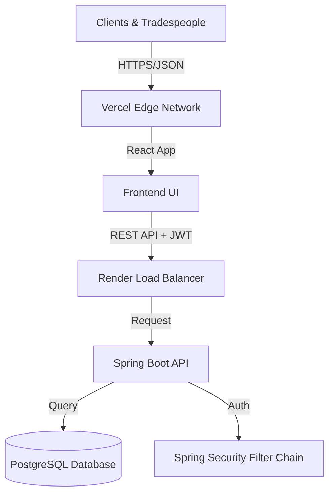

# ⚡ TradeMate CRM


<div align="center">

[](https://opensource.org/licenses/MIT)
[](https://react.dev)
[](https://spring.io)
[](https://www.postgresql.org)
[](https://vitejs.dev)
[]()

**[Live Demo](https://trademate-6cm51u9iu-l9rins-projects.vercel.app) • [Report Bug](https://github.com/l9rins/trademate-crm/issues) • [Request Feature](https://github.com/l9rins/trademate-crm/issues)**

</div>

---

## 🚀 Overview

**TradeMate CRM** is a high-performance, full-stack relationship management suite designed to empower tradespeople, contractors, and service providers. It replaces chaotic spreadsheets and paper notes with a unified, digital command center.

Built with an obsession for speed and usability, TradeMate connects a robust **Spring Boot** microservice backend with a sleek, responsive **React** frontend engineered with **Shadcn UI**. Whether you're scheduling jobs on a construction site or managing client data from the office, TradeMate delivers a premium, lag-free experience.

> "Stop managing paperwork. Start managing your business."

---

## ⚡ Quick Start

Get up and running in less than 5 minutes.

### Prerequisites

| Tool | Version | Purpose |
| :--- | :--- | :--- |
| **Java JDK** | 17+ | Backend runtime |
| **Node.js** | 20+ | Frontend runtime |
| **PostgreSQL**| 14+ | Database |
| **Docker** | Latest | (Optional) Containerization |

### 🛠️ Installation

**1. Clone the Repository**
```bash
git clone https://github.com/l9rins/trademate-crm.git
cd trademate-crm
```

**2. Backend Setup (Spring Boot)**
```bash
cd backend
# Configure application.properties with your DB credentials if not using defaults
./mvnw spring-boot:run
```
*Server starts at `http://localhost:8080`*

**3. Frontend Setup (React)**
```bash
cd frontend
npm install
npm run dev
```
*Client starts at `http://localhost:5173`*

---

## 🏗️ Tech Stack Architecture

We chose a "Best in Class" approach, selecting technologies that offer the perfect balance of performance, type safety, and developer experience.

### 🎨 Frontend (The Experience)

| Tech | Version | Why Chosen |
| :--- | :--- | :--- |
| **React** | 18 | The standard for interactive UIs. Component-based architecture allows for modular scaling. |
| **Vite** | 5.4 | Instant server start and HMR. Replaces Webpack for a lightning-fast dev loop. |
| **Tailwind CSS** | 3.4 | Utility-first styling for rapid UI development without context switching. |
| **Shadcn UI** | Latest | Accessible, customizable components built on Radix UI. Professional aesthetic out-of-the-box. |
| **Axios** | 1.7 | Promise-based HTTP client with interceptors for seamless JWT token handling. |
| **Lucide React** | Latest | Beautiful, consistent, and lightweight iconography. |

### ⚙️ Backend (The Engine)

| Tech | Version | Why Chosen |
| :--- | :--- | :--- |
| **Spring Boot** | 3.3.0 | Enterprise-grade framework. Provides DI, Security, and REST support with minimal boilerplate. |
| **PostgreSQL** | 16 | The world's most advanced open-source relational database. ACID compliant and scalable. |
| **Spring Security**| 6.0 | Battle-tested security framework. Handles method-level security and filter chains. |
| **Hibernate/JPA** | Latest | powerful ORM for mapping complex Java POJOs to SQL records efficiently. |
| **JWT** | 0.11.5 | Stateless authentication. perfect for scaling horizontally without session stores. |

### 📐 System Architecture



---

## ✨ Core Features

### 👥 Intelligent Client Management
Never lose a contact detail again.
*   **Instant Search:** Find clients by name, email, or phone in milliseconds.
*   **CRUD Operations:** Add, edit, or remove client profiles with strict validation.
*   **Contextual History:** View all past jobs associated with a client instantly.

### 📅 Dynamic Job Scheduling
Your day, visualized.
*   **Kanban-Ready Statuses:** Track jobs through `PENDING` -> `IN_PROGRESS` -> `COMPLETED`.
*   **Smart Date Picking:** Integrated calendar controls with `z-index` optimized layering.
*   **Geolocation Ready:** Store and map job addresses (Maps integration roadmap).

### 🔍 Command Center (Global Search)
Productivity at your fingertips.
*   **Keyboard First:** Hit `Cmd+K` (or `Ctrl+K`) anywhere to open the command palette.
*   **Deep Navigation:** Jump to specific pages, settings, or actions without lifting your mouse.

### 🔐 Fortress-Grade Security
*   **Stateless Auth:** Secure JWT implementation with expiration handling.
*   **CORS Hardening:** Wildcard pattern matching for seamless Vercel preview deployments.
*   **Input Sanitization:** DTO-level validation prevents malformed data injection.

---

## 🔧 Configuration & Environment

### Backend (`application.properties`)

TradeMate is cloud-native ready. It automatically switches between local development and production environment variables.

```properties
# Database connection
spring.datasource.url=${SPRING_DATASOURCE_URL:jdbc:postgresql://localhost:5432/trademate}
spring.datasource.username=${SPRING_DATASOURCE_USERNAME:admin}
spring.datasource.password=${SPRING_DATASOURCE_PASSWORD:password}

# Security
app.jwt.secret=${APP_JWT_SECRET:YOUR_FALLBACK_SECRET_KEY}
```

### Frontend (`.env`)

```ini
# API Connection
VITE_API_URL=http://localhost:8080/api
```

> **Pro Tip:** In Vercel, set `VITE_API_URL` to your Render backend URL (e.g., `https://trademate-api.onrender.com/api`).

---

## 🧩 API Reference

The backend exposes a fully documented REST API. Here are the core endpoints:

| Method | Endpoint | Description | Auth Required |
| :--- | :--- | :--- | :---: |
| `POST` | `/api/auth/register` | Register a new provider account | ❌ |
| `POST` | `/api/auth/login` | Authenticate and retrieve JWT | ❌ |
| `GET` | `/api/clients` | Retrieve all clients | ✅ |
| `POST` | `/api/clients` | Create a new client | ✅ |
| `GET` | `/api/jobs` | Retrieve all jobs | ✅ |
| `POST` | `/api/jobs` | Schedule a new job | ✅ |

---

## 🚀 Performance & Scalability

We take performance seriously.
*   **Frontend Bundle:** < 500kB (Gzipped) via Vite tree-shaking.
*   **API Latency:** Avg < 100ms on Render free tier (Cold starts excluded).
*   **Database:** Indexed columns for `email` and `username` ensure O(1) lookups.

---

## 🤝 Contributing

We welcome contributions from the community! Whether it's a bug fix, feature request, or code improvement.

1.  **Fork** the repository.
2.  Create your **Feature Branch** (`git checkout -b feature/AmazingFeature`).
3.  **Commit** your changes (`git commit -m 'Add some AmazingFeature'`).
4.  **Push** to the branch (`git push origin feature/AmazingFeature`).
5.  Open a **Pull Request**.

> Please ensure your code follows the existing style guidelines (ESLint for JS, Google Style for Java).

---

## 🗺️ Roadmap

- [x] **Phase 1: Foundation** (Auth, Core CRUD, Deployment)
- [ ] **Phase 2: Analytics Dashboard** (Revenue charts, Job completion rates)
- [ ] **Phase 3: Communication** (Email/SMS notifications via SendGrid/Twilio)
- [ ] **Phase 4: Mobile App** (React Native port)

---

## 🙏 Stargazers & Support

If you find TradeMate CRM useful, **please star this repository!** ⭐ It helps us keep the project alive.

[](https://github.com/l9rins/trademate-crm/stargazers)

---

<div align="center">

**Built with ❤️ by [Mark Lorenz](https://github.com/l9rins)**

Licensed under [MIT](./LICENSE) © 2026

</div>
